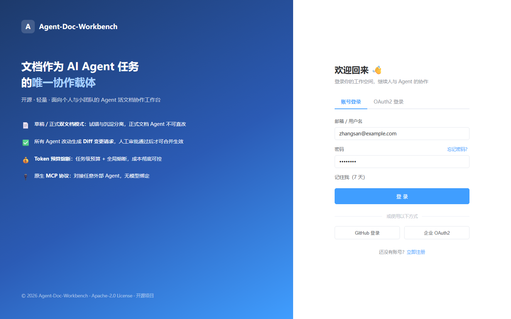
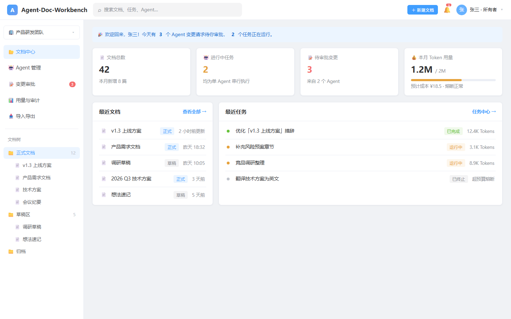
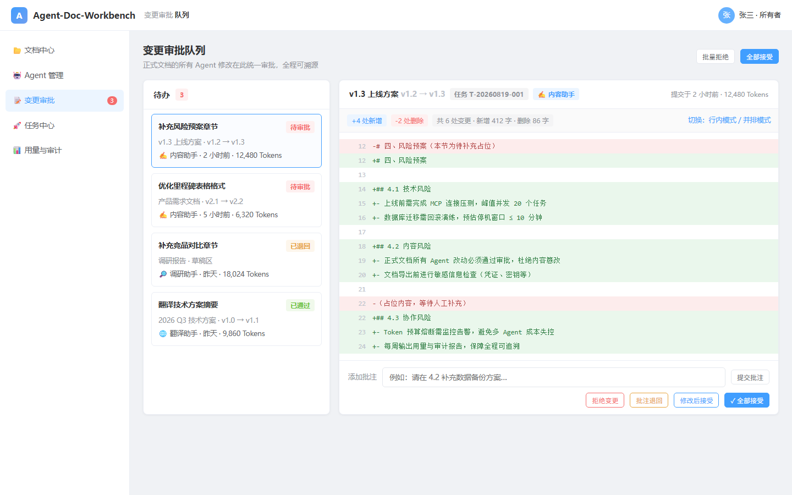

# Agent-Doc-Workbench

> An open-source, lightweight web workbench for AI-agent-powered document collaboration, built for individuals and small teams.
> Documents as the single collaboration vehicle for AI Agent tasks.

[](LICENSE) 

English | [简体中文](./README.md)

**Repository**
- Gitee: https://gitee.com/wu_hai123/agent-doc-workbench
- GitHub: https://github.com/xiaowu0203/Agent-Doc-Workbench
- Branches: main (stable) · phase-2 (Phase 2 document core, pending merge into main)

---

## Why this project?

Existing AI document tools (Notion AI, WPS AI) let AI rewrite documents directly — uncontrolled and untraceable.
Orchestration frameworks (LangGraph, CrewAI) keep task results in memory only, with nothing persisted.
Agent-Doc-Workbench treats **documents** as the collaboration carrier for Agent tasks, so every AI change is reviewable, revertible, and auditable.

## Core Features

- **Draft / Formal dual-document mode**: Agents may freely edit drafts for fast experimentation; formal documents are write-protected from Agents, preventing content tampering
- **Diff-based change approval**: all Agent modifications become structured change requests supporting accept-all / partial accept / reject / comment-and-return; merging automatically creates a version snapshot
- **Token budget circuit breaker**: per-task budgets plus a workspace-wide budget; automatic shutdown when limits are exceeded, keeping Agent costs under control
- **Standard A2A + MCP protocols**: tasks are dispatched to an independent Agent Server over A2A; Agents use Workbench tools over MCP
- **Agent permission control**: task capabilities bind workspace, document, and actions; Agents never inherit user permissions
- **End-to-end audit log**: operator (human/Agent), operation type, linked task — immutable and traceable
- **Version snapshots & rollback**: every merged change generates a version; one-click rollback to any historical version

## UI Mockups

| Login | Workspace Home | Diff Review (Core) |
| --- | --- | --- |
|  |  |  |

All 8 screens: [docs/ui-mockups/README.md](docs/ui-mockups/README.md).

## Tech Stack

| Layer | Choice |
| --- | --- |
| Backend | Spring Boot 3.5 · Java 21 · Spring Cloud 2025 · MyBatis-Plus · MySQL 5.7 |
| Messaging/Cache | RabbitMQ · Redis 7 · Redisson |
| Storage | MinIO (object storage) |
| Registry/Config | Nacos 3.2.2 |
| Agent integration | Spring AI · official A2A Java SDK · MCP Java SDK |
| Frontend | Vue 3 · TypeScript · Vite · Pinia · Element Plus · ProseMirror |
| Auth | Spring Authorization Server · OAuth2 · JWT (RS256) |

Details and rationale: [docs/tech/README.md](docs/tech/README.md).

## Architecture Overview

```
Frontend (Vue 3 + ProseMirror)
   │  OAuth2 / JWT
   ▼
Gateway (Spring Cloud Gateway · WebFlux)
   │
   ├── auth-service       Users, OAuth2, JWT
   ├── document-service   Spaces, directories, documents, versions, Diff approval
   ├── task-service       Agent tasks, A2A Client, Workbench MCP Server, Token ledger
   └── agent-service      Agent/Model config, A2A Server, Spring AI Runtime, MCP Client
         │
         ├── A2A: task-service → agent-service
         └── MCP: agent-service → task-service
```

## Current Progress

| Phase | Scope | Status |
| --- | --- | --- |
| Phase 0 | Engineering foundation: Git, Docker Compose, frontend/backend scaffolding | ✅ Completed (2026-08-20) |
| Phase 1 | Backend foundation: common (5 sub-modules), auth loop (JWT RS256 + JWKS), gateway routing/rate-limiting/OpenAPI aggregation, 14 tables (incl. Token stats 3-table architecture) | ✅ Completed and merged into main (2026-08-22) |
| Phase 2 | Document core: spaces/documents/versions/Diff approval | ✅ Completed (2026-08-23, pending merge into main) |
| Phase 3 | Agents & tasks: A2A Agent Server, Workbench MCP Server, Token circuit breaker | ✅ Completed (2026-08-24) |

Handoff docs: [docs/PHASE1-HANDOFF.md](docs/PHASE1-HANDOFF.md) · [docs/PHASE2-HANDOFF.md](docs/PHASE2-HANDOFF.md) · [docs/PHASE3-HANDOFF.md](docs/PHASE3-HANDOFF.md)

## Getting Started

> The Phase 3 Agent Server, A2A, and Workbench MCP implementation is available on `phase-3`.

```bash
# 1. Start infrastructure (MySQL / Redis / RabbitMQ / MinIO / Nacos)
docker compose up -d
# Tip: if MySQL / Redis are installed locally, start only the other three:
# docker compose up -d rabbitmq minio nacos

# 2. Start backend (Maven multi-module)
cd backend
./mvnw spring-boot:run -pl auth-service -am

# 3. Start frontend
cd frontend
pnpm install
pnpm dev
```

Backend service ports: Gateway `9090`, Auth `8081`, Document `8082`, Task `8083`, and Agent `8084`.
Frontend variables are documented in `frontend/.env.example`; infrastructure and secret templates are in `.env.example`.

## Development Roadmap

| Phase | Scope | Status |
| --- | --- | --- |
| Phase 0 | Engineering foundation: Git, Docker Compose, frontend/backend scaffolding | Completed |
| Phase 1 | Backend foundation: common, auth, gateway | Completed |
| Phase 2 | Document core: spaces/documents/versions/Diff | Completed, pending merge |
| Phase 3 | Agents & tasks: A2A Agent Server, Workbench MCP Server, Token circuit breaker | Completed |
| Phase 4 | Frontend: 8 core pages | Planned |
| Phase 5 | Integration & testing of the full loop | Planned |
| Phase 6 | Open-source release preparation | Planned |

See [docs/development-plan.md](docs/development-plan.md).

## Documentation

| Doc | Description |
| --- | --- |
| [docs/Agent-Doc-Workbench 项目完整开发规划文档.md](docs/Agent-Doc-Workbench%20项目完整开发规划文档.md) | Product planning: feature list, MVP scope, milestones (Chinese) |
| [docs/development-plan.md](docs/development-plan.md) | Development roadmap (Phase 0-6) |
| [docs/tech/README.md](docs/tech/README.md) | Finalized tech stack: backend, frontend, auth |
| [docs/ui-mockups/README.md](docs/ui-mockups/README.md) | UI mockups for all v0.1 pages |
| [docs/PHASE1-HANDOFF.md](docs/PHASE1-HANDOFF.md) | Phase 1 backend handoff doc (completed) |
| [docs/PHASE2-HANDOFF.md](docs/PHASE2-HANDOFF.md) | Phase 2 startup baseline (completed) |
| [docs/PHASE3-HANDOFF.md](docs/PHASE3-HANDOFF.md) | Phase 3 agents & tasks handoff doc |
| [CLAUDE.md](CLAUDE.md) | Project memory & collaboration conventions (incl. ADRs) |

## Open Source Plans

- License: Apache-2.0
- Goal: v0.1 should be clone-and-run; welcome individual developers and small teams to try and contribute
- CONTRIBUTING and security notes will be completed before the Phase 6 release

## License

Licensed under the [Apache-2.0](LICENSE) License.
