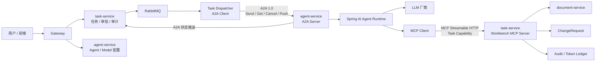
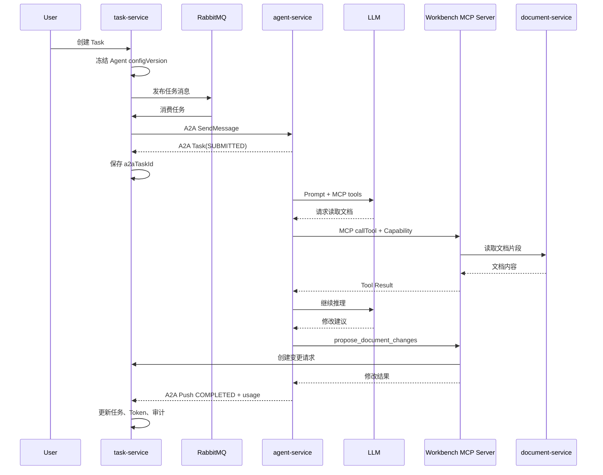

# Agent Server + MCP Server + 标准远程协议总体设计

> 状态：Phase 3 基线、Phase 4 的 Skill 渐进加载与外部多 MCP、Phase 5 的平台角色与空间 RBAC 已实现；Skill/MCP 细节分别见 [`skill-selection-and-progressive-loading-design.md`](skill-selection-and-progressive-loading-design.md) 和 [`external-mcp-architecture-design.md`](external-mcp-architecture-design.md)，权限细节见 [`tech/security.md`](tech/security.md)。
> 适用项目：Agent-Doc-Workbench
> 目标：落地独立 Agent Server、Workbench MCP Server，以及基于 A2A 与 MCP 的完整远程调用链路。

## 1. 设计结论

本项目采用两个清晰、对称的协议角色：

- `task-service`：任务编排中心，同时作为 **A2A Client** 和 **Workbench MCP Server**。
- `agent-service`：Agent 运行中心，同时作为 **A2A Server**、**MCP Client** 和 LLM 调用方。

现有由 `task-service` 通过 MCP 调用固定远程工具 `agent.execute` 的方式将被移除。MCP 不再承担 Agent 间任务协议：Agent 的启动、查询、取消和状态同步全部使用 A2A；MCP 只承担 Agent 对 Workbench 工具和数据的访问。

| 调用方向 | 协议 | 作用 |
| --- | --- | --- |
| 浏览器 → Gateway → 业务服务 | REST | 用户业务操作 |
| `task-service` → `agent-service` | A2A | 启动、查询、取消 Agent 任务 |
| `agent-service` → `task-service` | MCP | 读取文档、提交修改 |
| `agent-service` → LLM 厂商 | Spring AI Provider API | 模型推理与工具调用 |
| `agent-service` → `task-service` | A2A Push Notification | 异步状态与结果通知 |

### 1.1 当前服务角色边界

当前只有 `agent-service` 是 Agent 执行方，`task-service` 是普通业务编排方，不需要再运行一个 Agent。

```text
task-service
  ├─ A2A Client：提交、查询、取消 agent-service 的 Agent Task
  ├─ MCP Server：暴露 WorkbenchMcpTools 业务工具
  └─ A2A Push 回调接收端：接收 Agent 状态变更通知

agent-service
  ├─ A2A Server：管理 Agent Task 生命周期
  └─ MCP Client：发现并调用 task-service 的 Workbench MCP 工具
```

这里的 A2A 是 Agent 任务协议，不要求通信双方都是 Agent；MCP 则是 Agent 访问 Workbench 业务能力的工具协议。`task-service` 的 `/api/task/internal/a2a/events` 是 Push Notification 接收端点，不是完整的 A2A Server。

## 2. 总体架构



## 3. 服务边界

### 3.1 agent-service

新增独立 Maven 模块，默认端口 `8084`，负责：

- Agent、Model 和模型供应商配置。
- Skill 包、版本、Agent 绑定和运行时选择。
- 空间级外部 MCP 配置、Agent 绑定和工具命名空间。
- Agent 系统提示词和配置版本。
- 模型密钥加密存储。
- A2A Server 和 Agent Card。
- Spring AI `ChatClient` 与模型调用。
- MCP Client 和 MCP Tool Callback 装配。
- 单次 Agent 执行记录、不可变配置快照以及逐轮模型/工具调用审计。
- 执行超时、迭代上限、Token 预算和协作式取消。

`agent-service` 不直接访问文档、任务、变更请求和审计表。Agent 需要 Workbench 数据或操作能力时，必须通过 MCP Server。

### 3.2 task-service

继续负责：

- Task 创建和状态机。
- RabbitMQ 任务调度。
- A2A Client、状态回调和任务对账。
- Task Capability 签发、加密保存和业务回查。
- Token 权威账本。
- ChangeRequest 和 AuditLog。
- Workbench MCP Server。

`task-service` 不再直接调用 LLM，也不再持有模型密钥、Agent 系统提示词或 MCP Client 配置。

### 3.3 document-service

继续只负责文档读取、版本控制、空间权限、草稿变更应用和正式文档合并。MCP Tool 通过既有应用服务或 Feign 合约调用 `document-service`，协议逻辑不侵入文档领域。

### 3.4 gateway-service

| 路径 | 目标服务 | 说明 |
| --- | --- | --- |
| `/api/agent/**` | `agent-service` | Agent、Model 管理 API |
| `/.well-known/agent-card.json` | `agent-service` | 标准 Agent Card |
| `/a2a/**` | `agent-service` | A2A 协议入口 |
| `/mcp`、`/mcp/**` | `task-service` | MCP Streamable HTTP 入口 |

协议入口不能简单加入匿名白名单。Gateway 和下游服务应根据路由分别识别用户 JWT、服务 JWT 和 Task Capability JWT。

## 4. Agent、Model 与执行快照

### 4.1 AgentEntity

`AgentEntity` 从 `task-service` 迁移到 `agent-service`：

| 字段 | 说明 |
| --- | --- |
| `id` | Agent ID |
| `space_id` | 所属空间 |
| `name` | Agent 名称 |
| `description` | 描述 |
| `system_prompt` | 用户可配置系统提示词 |
| `model_id` | 使用的模型 |
| `status` | 启用状态枚举 |
| `config_version` | 配置版本，每次有效修改递增 |
| `max_iterations` | 单次执行最大模型迭代次数 |
| `execution_timeout_seconds` | 单次执行超时 |
| `tool_whitelist` | Agent 允许向模型暴露的工具上限 |
| `skill_selection_mode` | Skill 选择模式：全部绑定或 Router 筛选 |
| `skill_router_model_id` | 可选的独立 Skill Router 模型 |
| `external_mcp_enabled` | 外部 MCP 总开关 |
| `created_by` | 创建人 |
| `created_at`、`updated_at` | 审计时间 |

原 `mcp_config` 不再作为生效配置，只作为尚未执行删除迁移的历史字段保留。Workbench MCP Server 始终按任务注入；外部 MCP 从空间级 `mcp_server` 与 Agent 绑定加载。`tool_whitelist`、Skill `allowed-tools` 和 MCP 绑定白名单共同收紧模型可见工具，但不能扩大 Task Capability 权限。

### 4.2 ModelEntity

`ModelEntity` 同样迁移到 `agent-service`：

| 字段 | 说明 |
| --- | --- |
| `provider` | 模型供应商枚举 |
| `adapter_type` | 实际调用协议适配器类型 |
| `model_key` | 供应商真实模型标识 |
| `display_name` | 展示名称 |
| `base_url` | 可选自定义模型地址 |
| `encrypted_api_key` | 加密后的模型密钥 |
| `options_json` | 适配器扩展配置 JSON |
| `config_version` | 模型调用配置版本，每次有效修改递增 |
| `context_window` | 上下文窗口 |
| `max_output_tokens` | 最大输出 Token |
| `input_price_per_million` | 输入价格 |
| `output_price_per_million` | 输出价格 |
| `status` | 启用状态枚举 |

模型密钥使用独立的 `AGENT_CONFIG_KEY` 加密，接口不返回密钥明文或密文。
运行时按 `model_id + config_version` 缓存 ChatModel 实例，缓存采用有界 LRU；模型配置变更时主动失效该模型的全部旧版本，淘汰或服务关闭时释放厂商客户端资源。
模型适配器同时提供单次调用和流式调用边界；流式调用只在 A2A `message:stream` 请求中启用，文本增量通过 `AgentEmitter` 推送，工具调用仍由上层统一循环处理。

### 4.3 AgentExecutionEntity

新增 `agent_execution` 表，作为 A2A Task 在 Agent 服务中的持久化执行记录：

| 字段 | 说明 |
| --- | --- |
| `id` | 内部执行 ID |
| `a2a_task_id` | A2A Server 生成的标准任务 ID，唯一 |
| `a2a_context_id` | A2A 标准上下文 ID，用于安全隔离列表查询 |
| `workbench_task_id` | Workbench Task ID，唯一幂等键 |
| `agent_id` | Agent ID |
| `agent_config_version` | 本次执行冻结的配置版本 |
| `system_prompt_snapshot` | 系统提示词完整快照 |
| `model_snapshot` | 模型配置快照，不包含明文密钥 |
| `prompt_hash` | 提示词审计哈希 |
| `status` | 执行状态枚举 |
| `cancel_requested` | 是否请求取消 |
| `input_tokens`、`cached_input_tokens`、`output_tokens` | Token 用量 |
| `result_summary` | 结果摘要 |
| `error_message` | 失败原因 |
| `started_at`、`finished_at` | 执行时间 |

完整 Prompt 快照保存在 `agent_execution`。`TaskEntity` 只保存 `agent_config_version`、`agent_execution_id`、`a2a_task_id` 和 `prompt_hash`，避免跨服务复制 Agent 配置所有权。

## 5. Prompt 组合规则

```text
平台不可编辑安全提示词
+ AgentExecution.systemPromptSnapshot
+ Task.instruction
```

- 平台安全提示词：位于 `agent-service` 的版本化资源文件中，用户不可编辑。
- Agent 系统提示词：来自 `AgentEntity.systemPrompt`，创建执行时冻结。
- 任务指令：来自 `TaskEntity.instruction`，作为用户消息发送。

文档正文不由 `task-service` 预读取后整体塞入 Prompt。Agent 根据需要调用 MCP 工具按片段读取，避免大文档占满上下文窗口。

## 6. A2A 协议设计

### 6.1 协议基线

- A2A 1.0。
- HTTP+JSON/REST binding。
- 使用官方 A2A Java SDK，不自行复制标准 DTO。
- 支持 Agent Card、Send、Get、List、Cancel、流式订阅和 Push Notification Config 管理。

标准入口：

```text
GET  /.well-known/agent-card.json
POST /a2a/message:send
POST /a2a/message:stream
GET  /a2a/tasks/{id}
GET  /a2a/tasks
POST /a2a/tasks/{id}:cancel
GET  /a2a/tasks/{id}:subscribe
POST /a2a/tasks/{id}/pushNotificationConfigs
GET  /a2a/tasks/{id}/pushNotificationConfigs
GET  /a2a/tasks/{id}/pushNotificationConfigs/{configId}
DELETE /a2a/tasks/{id}/pushNotificationConfigs/{configId}
```

Agent Card 至少声明：

```text
skill: document-collaboration
inputModes: text/plain, application/json
outputModes: text/plain, application/json
streaming: true
pushNotifications: true
```

官方资料：

- [A2A 1.0 规范](https://github.com/a2aproject/A2A/blob/main/docs/specification.md)
- [A2A Java SDK](https://github.com/a2aproject/a2a-java)

### 6.2 A2A 任务输入

任务指令使用 A2A `TextPart`，Workbench 执行上下文使用 `DataPart`：

```json
{
  "workbenchTaskId": 10001,
  "agentId": 20,
  "spaceId": 10,
  "documentId": 300,
  "tokenBudget": 20000,
  "mcpServerUrl": "https://workbench.example.com/mcp",
  "taskCapability": "***"
}
```

约束：

- `workbenchTaskId` 是幂等键。
- A2A Task ID 由 Agent Server 生成并回写 Task。
- Task Capability 不进入日志、审计详情、Agent 历史或结果 Artifact。
- A2A 使用 Task Capability 作为标准 HTTP Bearer 凭证；消息体中的 Capability 必须与请求头完全一致。
- Agent Server 在 SDK 接收请求前校验 task、agent、space、document 四项范围；Task 查询、取消、订阅和 Push Config 同样进行范围隔离。

### 6.3 异步任务模型

1. MQ 消费者将 Task 从 `PENDING` 更新到 `DISPATCHED`。
2. 调用 A2A Send Message。
3. 保存 A2A Task ID。
4. Agent Server 返回 `SUBMITTED` 后确认 MQ 消息。
5. Agent Server 异步执行模型与工具循环。
6. 状态通过 A2A Push Notification 回传。
7. 当前以 A2A Push Notification 回传为主；task-service 通过 Spring `@Scheduled` 定时调用 A2A Get Task，对长时间无心跳的活动任务执行状态对账，并使用 Redis 锁避免重复处理。

MQ 消费线程不会阻塞等待模型执行，也不会在远端已经执行时因为消息重投而重复启动 Agent。

### 6.4 查询、执行与事件职责

`agent-service` 的 A2A 请求处理由官方 `DefaultRequestHandler` 统一分发，不由 `AgentExecutor` 负责所有接口：

```text
message:send  → 创建/保存 Task → 排队 → AgentExecutor.execute(...)
tasks/{id}    → TaskStore.get(id)
tasks/{id}:cancel → 更新任务/队列 → AgentExecutor.cancel(...)
```

其中：

- `AgentExecutor` 只负责实际 Agent 执行和取消；
- `TaskStore` 负责完整 A2A Task 的保存和查询；
- `MainEventBusProcessor` 消费 `AgentEmitter` 产生的状态、Artifact 事件，并驱动 Push Notification。

Agent 执行成功时，`addArtifact` 保存执行摘要和 Token 元数据，`complete` 将 Task 标记为完成；两者职责不同。task-service 收到 Push 后再通过 `GET /a2a/tasks/{id}` 拉取完整 Task，并从摘要 Artifact 同步本地结果。

## 7. Workbench MCP Server

### 7.1 协议基线

- MCP 2025-06-18。
- Streamable HTTP。
- `spring-ai-starter-mcp-server-webmvc`。
- 单一 `/mcp` 端点。
- 使用 `@McpTool` 暴露工具并生成 JSON Schema。

当前工程使用 Spring AI 1.1.8 和 MCP Java SDK 0.18.3，因此先锁定可以通过依赖和协议测试验证的版本。2026-07-28 MCP 规范升级隔离在 MCP 基础设施适配层，不在本次架构迁移中混合升级整个 Spring 技术栈。

官方资料：

- [MCP Streamable HTTP Transport](https://modelcontextprotocol.io/specification/2025-06-18/basic/transports)
- [Spring AI MCP Server](https://docs.spring.io/spring-ai/reference/api/mcp/mcp-server-boot-starter-docs.html)

### 7.2 核心工具

第一批只实现三个具备完整业务闭环的工具。

#### workbench_get_task_context

返回文档 ID、文档类型、当前版本和总长度。不接受 `spaceId`、`agentId` 等身份参数，这些可信字段从 Task Capability 取得。

#### workbench_read_document_fragment

```json
{
  "offset": 0,
  "length": 4000
}
```

- 只能读取 Capability 中绑定的文档。
- 限制单次最大读取长度。
- 每次调用重新校验任务状态、Token 有效期和 action scope。

#### workbench_propose_changes

```json
{
  "baseVersion": 8,
  "changes": [],
  "summary": "修改摘要"
}
```

- 当前所有 Agent 变更统一创建 ChangeRequest，等待人工审批，不直接修改文档。
- 后续若开放草稿直写，也必须复用文档领域服务并保留版本校验与审计，不能由 MCP Tool 直接落库。
- 服务端根据 Capability 确认 task、agent、space 和 document，不信任工具参数中的身份字段。

稳定返回结果：

```json
{
  "outcome": "CHANGE_REQUEST_CREATED",
  "changeRequestId": 123,
  "documentVersion": 8
}
```

MCP Tool 类只负责参数转换和调用应用服务，不包含文档类型判断、审批创建或审计业务。

### 7.4 工具发现与路由

Agent 不需要知道 task-service 的 Java 类名。MCP 初始化后，agent-service 通过 `tools/list` 获取工具名、描述和参数 Schema；模型决定调用工具后，MCP Client 发送 `tools/call`：

```text
tools/call
  name: workbench_read_document_fragment
  arguments: { start, length }
```

task-service 的 Spring AI MCP Server 根据 `@McpTool(name = "workbench_read_document_fragment")` 注册表，将调用路由到 `WorkbenchMcpTools.readDocumentFragment(...)`，再由该门面转发到 `WorkbenchMcpApplicationService`。工具调用携带的 Task Capability 由 MCP 安全过滤器和 `McpTaskScopeService` 校验，之后才访问文档或变更业务。

## 8. Agent Runtime

`agent-service` 使用 Spring AI `ChatClient` 执行 Agent：

1. 冻结 Agent、Model、Skill、工具白名单和外部 MCP 配置。
2. 根据 Agent 模式选择候选 Skill，生成唯一的执行系统提示词与脱敏快照。
3. 创建携带 Task Capability 的 Workbench MCP Client，并连接本次有权限使用的外部 MCP。
4. 合并 Skill 本地工具、Workbench MCP 工具和带命名空间的外部 MCP 工具，校验名称与权限边界。
5. 执行统一的模型工具调用循环，按轮记录脱敏模型调用审计，按次记录工具调用审计。
6. 使用本次 Task 已冻结预算和模型输出上限共同限制 completion tokens，执行结束后回传实际用量。
7. 在迭代之间检查取消标记、超时和最大迭代次数。
8. 逆序关闭全部任务专属工具会话。
9. 通过 A2A 状态和 Artifact 返回摘要与 Token 用量。

Task Capability 是任务级短期凭证，因此不使用应用启动时创建的全局 MCP Client。每个 AgentExecution 创建独立 Client，并在执行结束后关闭。

预算约束：

- 使用本次 Task 已冻结预算与模型最大输出 Token 的较小值限制输出。
- 工具迭代次数由 Agent 配置限制，迭代之间检查取消标记。
- Spring AI 内部工具循环当前不能按每一轮精确结算并抢占 Token；`task-service` 在完成回调后做权威核算和超限终止。

## 9. 完整执行时序



## 10. 状态机

```text
PENDING
  → DISPATCHED
  → RUNNING
  → COMPLETED

RUNNING → WAITING_INPUT → RUNNING
RUNNING → WAITING_AUTH → RUNNING

PENDING / DISPATCHED / RUNNING / WAITING_*
  → CANCELING
  → TERMINATED

任意非终态 → FAILED
```

| A2A TaskState | Workbench TaskStatus |
| --- | --- |
| `TASK_STATE_SUBMITTED` | `DISPATCHED` |
| `TASK_STATE_WORKING` | `RUNNING` |
| `TASK_STATE_INPUT_REQUIRED` | `WAITING_INPUT` |
| `TASK_STATE_AUTH_REQUIRED` | `WAITING_AUTH` |
| `TASK_STATE_COMPLETED` | `COMPLETED` |
| `TASK_STATE_FAILED` | `FAILED` |
| `TASK_STATE_REJECTED` | `FAILED` |
| `TASK_STATE_CANCELED` | `TERMINATED` |

用户终止任务时不能直接写 `TERMINATED`：

1. 本地状态进入 `CANCELING`。
2. 调用 A2A Cancel Task。
3. 收到远端 `CANCELED` 后进入 `TERMINATED`。
4. 对取消超时的任务进行对账并记录明确错误原因。

Task 完成和 ChangeRequest 审批是两个独立状态机。Agent 已提交正式文档变更后，A2A Task 可以完成，但 ChangeRequest 仍可处于待审批状态。

## 11. 鉴权模型

当前闭环使用两类身份，禁止混用。Task Capability 同时承担远程协议认证和任务级授权，适合本项目一项远程执行对应一个 Workbench Task 的安全模型；未来若开放非任务级 Agent 管理协议，再单独引入服务身份。

### 11.1 用户 JWT

用于普通业务 API：

```text
/api/task/**
/api/agent/**
/api/document/**
```

用户 JWT 包含 `scope=user`、`sub=userId` 和 `platformRoles`。普通业务接口先由 Resource Server 建立用户身份，再由 Controller 的 `@PreAuthorize` 和空间权限服务判定当前用户是否能访问目标空间。`PLATFORM_SUPER_ADMIN` 只用于平台角色管理及约定的跨空间读取能力，不自动授予所有空间写权限。

### 11.2 Task Capability JWT

用于 `task-service → agent-service /a2a`、A2A 回调校验以及 `agent-service → task-service /mcp`。Claims：

```text
tokenType=task-capability
taskId
agentId
spaceId
documentId
actions
exp
jti
```

最终使用标准 HTTP Bearer Header：

```http
Authorization: Bearer <task-capability>
```

`X-TASK-CAPABILITY` 仅作为内部兼容头保留。A2A 与 MCP 标准端点统一使用 Bearer Header；每次请求都重新验证签名、有效期、actorType、scope、任务绑定关系和 Task 状态，MCP Tool 额外验证 action。

参考：[MCP Authorization](https://modelcontextprotocol.io/specification/2025-03-26/basic/authorization)

## 12. 数据库迁移

既有 V1 基线保持不变，Phase 5 新增 V2/V3 增量迁移：

### agent 表

- 新增 `system_prompt`。
- 新增 `config_version`。
- 新增 `max_iterations`。
- 新增 `execution_timeout_seconds`。
- 废弃 `mcp_config`、`client_id`、`tool_whitelist` 的旧执行语义。

### model 表

- 新增 `base_url`。
- 新增 `encrypted_api_key`。

### agent_execution 表

- 新建 Agent 执行、配置快照、状态和 Token 用量表。
- `a2a_task_id` 唯一。
- `workbench_task_id` 唯一，保证任务提交幂等。

### task 表

- 新增 `agent_config_version`。
- 新增 `agent_execution_id`。
- 新增 `a2a_task_id` 和 `a2a_context_id`。
- 新增 `prompt_hash`。
- 新增 `dispatched_at` 和 `last_heartbeat_at`。
- 扩充 Task 状态枚举。

### A2A 协议状态表

- `a2a_task_store`：保存 A2A Task 的上下文、状态时间和 AES-GCM 加密载荷。
- `a2a_push_config`：保存 Push Notification 配置和 AES-GCM 加密载荷。
- 两类载荷均由 agent-service 解密后交给官方 SDK，服务重启可恢复任务与推送配置。

物理数据库本期可以保持同一个 MySQL 实例，但代码层必须严格执行表所有权：

- `agent-service` 只读写 Agent、Model、AgentExecution。
- `task-service` 只读写 Task、ChangeRequest、Audit、Token。
- 跨服务数据通过服务接口和标准协议获得，不跨服务注入 Mapper。

## 13. 建议代码结构

```text
backend/
├── agent-service/
│   └── src/main/java/com/agentdoc/agent/
│       ├── a2a/server/
│       ├── application/
│       ├── controller/
│       ├── convertor/
│       ├── enums/
│       ├── execution/
│       ├── mapper/
│       ├── mcp/client/
│       ├── pojo/{dto,entity,vo}/
│       ├── prompt/
│       ├── security/
│       └── service/
│
└── task-service/
    └── src/main/java/com/agentdoc/task/
        ├── a2a/{client,callback,convertor}/
        ├── execution/
        ├── mcp/{server,tool,convertor}/
        └── service/
```

协议 DTO 直接使用官方 SDK。项目自定义 DTO 只表达 Workbench 数据，不复制 A2A 或 MCP 标准模型。

## 14. 现有代码迁移清单

- 删除 `task-service` 中的 `McpAgentRuntime`。
- 删除旧 `AgentRuntime` 的“通过 MCP 调用外部 agent.execute”语义。
- 删除旧 MCP 响应解析器和对应测试。
- 将 Agent、Model 的 Entity、Mapper、Service、Controller、DTO、VO、枚举和配置加密服务迁移到 `agent-service`。
- 重写 `TaskExecutionService`，只负责异步 A2A 分发。
- `TaskService` 通过 Agent 服务接口校验 Agent 和冻结配置版本。
- `TokenUsageService` 接收 A2A 执行结果中的模型与 Token 快照，不再跨服务查询 `ModelMapper`。
- `ChangeRequestService` 接收 MCP 工具提交的业务变更，不再依赖旧 `AgentExecutionResult`。
- 新增 A2A 状态回调和取消；已接入定时 Get Task 状态对账及 Redis 分布式锁。
- 新增 MCP Server 及三个核心工具。
- 更新 Gateway、Swagger 聚合、部署环境变量和开发文档。

## 15. 代码规范约束

- 状态、权限、动作、供应商类型全部使用枚举，不写魔法值。
- Entity 创建集中在 DTO、Convertor 或 Factory，不在 Service 中堆叠大量 `set`。
- 所有包统一在文件顶部 `import`；只有同名类冲突时才在业务代码中使用全限定类名。
- Controller、A2A Endpoint、MCP Tool 只做协议转换、参数校验和应用服务调用。
- 不自行复制 A2A/MCP 标准 DTO。
- 不增加没有实际调用路径的 Mock Runtime。
- 不跨服务使用对方 Mapper。
- 配置密钥、Capability、完整 Prompt 不写日志。
- 状态转换使用带原状态条件的数据库更新，保证幂等和并发安全。

## 16. 测试与验收标准

### 16.1 单元测试

- Prompt 组合和快照。
- A2A 状态映射和 Task 状态转换。
- Agent 配置版本递增。
- MCP Tool 参数和 Capability scope。
- Task 预算传递、最大迭代和取消。
- Agent 变更统一创建 ChangeRequest。

### 16.2 协议测试（待接入真实服务环境）

- Agent Card 可发现且内容有效。
- A2A Send/Get/List/Cancel 可互操作。
- A2A Push Notification 幂等。
- MCP initialize、tools/list、tools/call 可互操作。
- MCP Streamable HTTP 每次请求正确鉴权。

### 16.3 安全测试

- 过期 Capability 返回 401。
- 跨 Task、Agent、Space、Document 使用被拒绝。
- 缺少 action scope 被拒绝。
- 已终止或失败 Task 不能继续调用 MCP 工具。
- 用户 JWT 不能替代 Task Capability 调用 MCP。
- Task Capability 不能调用普通用户 API。

### 16.4 集成测试（待接入真实基础设施）

必须通过完整闭环：

```text
创建 Task
→ MQ 分发
→ A2A Agent Server
→ LLM 请求 MCP Tool
→ MCP 读取文档
→ MCP 提交修改
→ 生成 ChangeRequest
→ A2A 完成通知
→ Task、Token、Audit 正确落库
```

### 16.5 完成定义

- 旧 `McpAgentRuntime` 不再存在。
- `task-service` 不依赖 Spring AI MCP Client。
- `agent-service` 不直接访问文档和任务表。
- Agent Server 可以独立部署到远程机器。
- A2A 和 MCP 的核心适配代码通过编译及单元测试；真实协议互操作测试待执行。
- 全部后端测试和 Maven `verify` 通过。
- 文档与实际代码、配置和数据库迁移一致。

当前代码完成定义中，除真实协议互操作与完整基础设施闭环外，其余条目已落地。Agent Server 的 A2A TaskStore 与 PushNotificationConfigStore 已切换为 MySQL 持久化实现；task-service 已接入定时状态对账。仍需在部署环境执行完整的协议互操作和端到端基础设施闭环验证。

## 17. 实施顺序

1. 新增 `agent-service` 模块和数据库增量迁移。
2. 迁移 Agent、Model 所有权并保持管理 API 可用。
3. 实现 AgentExecution、Prompt 快照和 Spring AI Runtime。
4. 实现 A2A Server 与 Agent Card。
5. 在 `task-service` 实现 A2A Client、状态回调和取消。
6. 在 `task-service` 实现 Workbench MCP Server。
7. 将 Agent Runtime 接入 MCP Client 和工具调用。
8. 切换 `TaskExecutionService`，移除旧 MCP Agent Runtime。
9. 补充协议、安全和端到端测试（当前已完成核心单元测试，真实基础设施闭环待执行）。
10. 更新部署配置、技术文档并执行全量验证。

每个阶段必须保持工程可编译。当前旧链路已移除；正式部署前必须补齐真实协议互操作、基础设施闭环以及 A2A 协议状态持久化验证。
