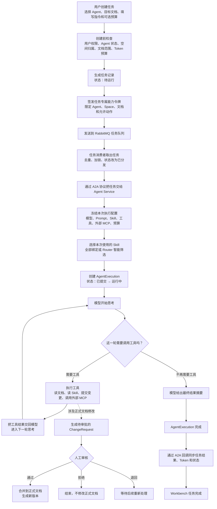
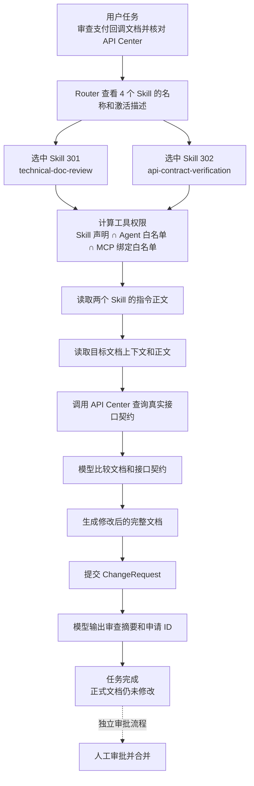

# Agent 任务执行流程

本文用两张流程图说明 Agent Doc Workbench 中一次 Agent 任务如何运行，以及 Skill、MCP 与 Tool 在实际执行中的关系。

当前 V0.1 采用手动触发模式：用户创建任务时明确选择一个 Agent；一个任务只由一个 Agent 执行。多个 Agent 的自动规划与编排属于后续演进范围。

## 1. Agent 任务完整执行流程

可以把整个过程口语化地理解为：Workbench 先确认“谁能做、能碰哪些文档、最多花多少预算”，再把任务交给选定的 Agent。Agent 根据本次冻结的配置，让模型在“思考—调用工具—读取工具结果—继续思考”之间循环，直到输出最终结果。

其中，模型提交正式文档变更只会创建 ChangeRequest，不会直接改写正式文档。后续是否合并由独立的人工审批流程决定。

## 2. 一个具体任务如何执行

假设用户创建了以下任务：

- 任务内容：审查《支付回调接入说明》，并与 API Center 中的真实接口契约核对。
- 选择的 Agent：技术文档审查 Agent。
- Agent 绑定的 Skill：`technical-doc-review`、`api-contract-verification`，以及两个与本任务无关的 Skill。
- Agent 绑定的外部 MCP：API Center MCP。
- Agent 工具白名单：允许读取文档、读取 Skill 指令、查询 API Center，以及提交文档变更申请。

执行时，Router 不需要加载四个 Skill 的全部正文，只根据轻量目录选出与任务相关的两个 Skill。系统随后读取这两个 Skill 的完整指令，并计算本次真正可用的工具集合。

这里三个概念的分工是：

- **Skill**：描述“这类事情应该怎么做”的流程、规则和参考资料；它可以声明执行中需要哪些工具，也可以只包含操作规范而不依赖任何工具。
- **MCP**：把平台内部或外部系统的能力，以统一协议提供给 Agent。MCP 服务可以提供一个或多个 Tool。
- **Tool**：模型在某一轮中真正发起调用的原子能力，例如读取文档、查询接口契约或提交 ChangeRequest。

因此，Skill 不等同于 Tool。Skill 主要约束执行方法；当流程需要操作数据或外部系统时，模型再调用当前权限范围内的 Tool。Tool 的执行结果会返回给模型，模型据此决定继续调用工具还是结束任务。
