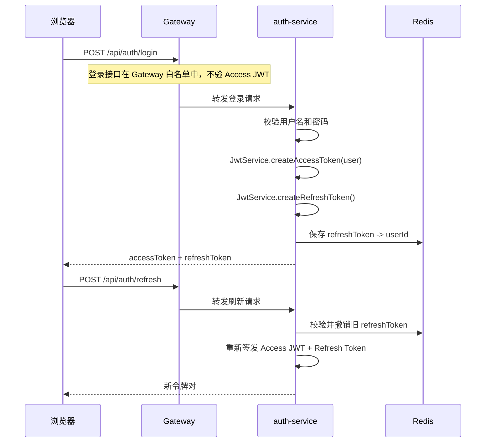
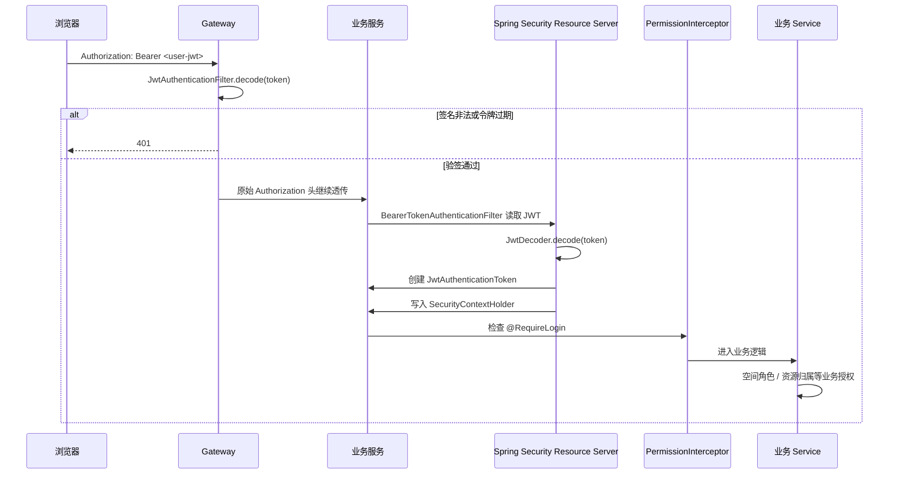
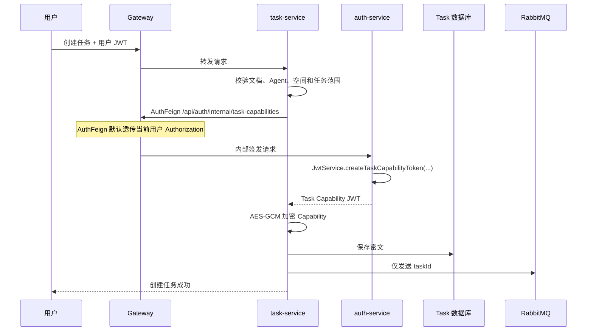
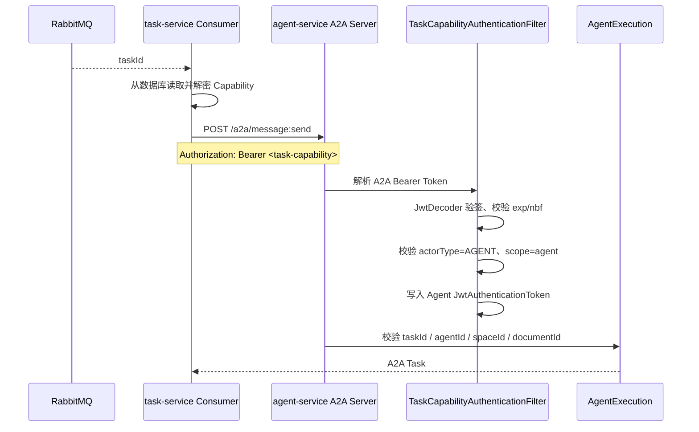
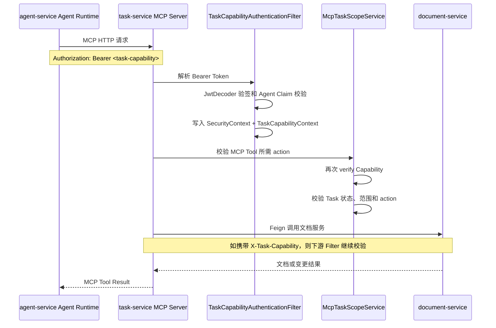
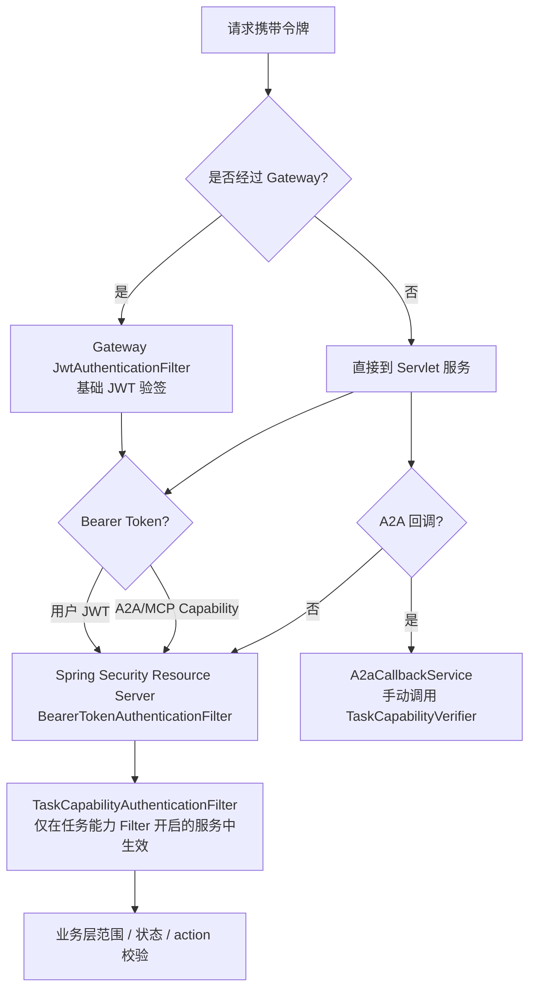

# 签名颁发与验签链路解析

> 本文以当前代码和默认配置为准，梳理用户 JWT、Task Capability JWT、Gateway、下游 Resource Server、MQ、A2A、MCP 以及 A2A 回调的完整链路。

## 1. 先看结论

当前系统存在两类 JWT，但签发中心只有一个：`auth-service`。

| 令牌 | 签发位置 | 主要使用者 | 核心标识 |
| --- | --- | --- | --- |
| 用户 Access JWT | `auth-service` 的 `JwtService.createAccessToken` | 浏览器和普通业务 API | `scope=user`、`sub=userId` |
| Task Capability JWT | `auth-service` 的 `JwtService.createTaskCapabilityToken` | 异步任务、A2A、MCP | `scope=agent`、`actorType=AGENT`、`taskId`、`agentId`、`spaceId`、`documentId`、`agentActions` |

两类 JWT 共用 Auth-Service 的 RSA 私钥和 JWKS 公钥，但用途和业务语义不同。`Refresh Token` 是 Redis 中维护的随机不透明字符串，不是 JWT，不进行 JWT 签名验签。

验签和授权需要分开理解：

1. JWT 验签：确认令牌确实由 Auth-Service 签发，且没有被篡改、没有过期。
2. 令牌类型校验：确认它是用户 JWT 还是 Task Capability JWT。
3. 业务授权：确认用户/Agent 是否有权访问具体空间、文档、任务和动作。

## 2. 系统总链路

```mermaid
flowchart LR
    Browser[浏览器 / 用户] -->|登录 / 刷新| Gateway[ gateway-service ]
    Gateway --> Auth[ auth-service ]
    Auth -->|RSA 私钥签发| UserToken[用户 Access JWT]
    Auth -->|Redis 保存| Refresh[Refresh Token]
    UserToken --> Browser
    Refresh --> Browser

    Browser -->|Authorization Bearer 用户 JWT| Gateway
    Gateway -->|JwtAuthenticationFilter - 基础验签| Business[业务服务]
    Business -->|Resource Server - 再次解析 Bearer JWT| Security[SecurityContext / JwtAuthenticationToken]
    Security --> UserBiz[用户业务权限校验]

    UserBiz -->|创建任务| Task[task-service]
    Task -->|AuthFeign + 用户 JWT| Gateway
    Gateway --> Auth
    Auth -->|RSA 私钥签发| Capability[Task Capability JWT]
    Capability -->|加密保存| TaskStore[Task 数据库]
    Task --> MQ[RabbitMQ - 仅投递 taskId]
    MQ --> Consumer[TaskExecutionService]
    Consumer -->|解密 Capability| Capability
    Consumer -->|A2A Bearer Capability| Agent[agent-service /a2a]
    Agent -->|TaskCapabilityAuthenticationFilter| AgentContext[Agent SecurityContext]
    AgentContext --> Runtime[Agent Runtime]
    Runtime -->|MCP Bearer Capability| MCP[task-service /mcp]
    MCP -->|TaskCapabilityAuthenticationFilter| McpContext[MCP 请求上下文]
    McpContext --> Document[document-service / 业务能力校验]
```



## 3. 普通用户 JWT 链路

### 3.1 登录和刷新



核心代码：

- 签发用户 JWT：`backend/auth-service/.../service/JwtService.java:166`
- 登录/刷新业务：`backend/auth-service/.../service/AuthService.java:68`
- Gateway JWT 门禁：`backend/gateway-service/.../security/JwtAuthenticationFilter.java:93`

### 3.2 普通业务请求



下游 Resource Server 的实际装配位置是：

```text
common-security-spring-boot-starter
└── CommonSecurityAutoConfiguration
    ├── businessJwtDecoder：从 auth-service JWKS 获取公钥
    └── http.oauth2ResourceServer(...)
        └── Spring Security 内部 BearerTokenAuthenticationFilter
```

代码位置：

- 创建下游 `JwtDecoder`：`backend/common/common-security-spring-boot-starter/.../config/CommonSecurityAutoConfiguration.java:60`
- 开启 Resource Server：`.../CommonSecurityAutoConfiguration.java:93`
- 根据 `SecurityContext` 检查登录：`backend/common/common-web-spring-boot-starter/.../security/PermissionInterceptor.java:60`
- 从 `SecurityContext` 读取用户 ID：`backend/common/common-core/.../utils/AuthUtils.java:32`

`task-service`、`document-service`、`agent-service` 通过以下配置开启这套能力：

```yaml
agent-doc:
  security:
    jwks-url: http://localhost:8081/oauth2/jwks
```

`auth-service` 使用自己的 `SecurityConfig` 配置 Resource Server，位置是 `backend/auth-service/.../config/SecurityConfig.java:61` 和 `:99`。

### 3.3 `/me` 和 `/logout`

| 接口 | Gateway | Auth-Service | 说明 |
| --- | --- | --- | --- |
| `/api/auth/me` | 验证用户 Access JWT | Resource Server 验证并建立身份 | `AuthUtils.getUserIdOrException()` 读取 `sub` |
| `/api/auth/logout` | 白名单放行 | `permitAll` | 不验 Access JWT，只撤销 Refresh Token |

因此，登出不是“用户 JWT 验签链路”，而是“Refresh Token 撤销链路”。

## 4. Task Capability JWT 链路

### 4.1 签发



签发时，`task-service` 先完成资源和范围判断；`auth-service` 负责使用 RSA 私钥生成 JWT。Capability 当前由 `AuthConstant.TASK_CAPABILITY_TTL_HOURS` 控制，代码值为 6 小时。

核心代码：

- TaskService 调用 Auth：`backend/task-service/.../service/TaskService.java:108`
- AuthFeign 契约：`backend/common/common-core/.../feign/AuthFeign.java:12`
- Auth-Service 内部签发接口：`backend/auth-service/.../controller/AuthController.java:65`
- Capability JWT 生成：`backend/auth-service/.../service/JwtService.java:186`

### 4.2 异步 MQ 和 A2A



当前默认配置中，`task-service -> agent-service` 的 A2A 地址是 `http://localhost:8084`，因此内部默认直连 Agent Service，不经过 Gateway。若把 A2A 地址配置为 Gateway，则会额外经过 Gateway 的 `JwtAuthenticationFilter`。

## 5. MCP 链路



当前默认配置中，Agent 使用 `http://localhost:8083/mcp`，也是内部直连。MCP 的 Token 由 `SpringAiAgentExecutionRuntime` 显式设置到 `Authorization` Header。

相关代码：

- 设置 MCP Bearer：`backend/agent-service/.../execution/SpringAiAgentExecutionRuntime.java:49`
- MCP Filter：`backend/common/common-security-spring-boot-starter/.../security/TaskCapabilityAuthenticationFilter.java:71`
- MCP 业务范围校验：`backend/task-service/.../mcp/McpTaskScopeService.java:22`

## 6. 各入口到底由谁验签



| 场景 | 基础 JWT 验签 | Agent 令牌校验 | 业务授权 |
| --- | --- | --- | --- |
| 普通用户 API，经 Gateway | Gateway Filter + 下游 Resource Server | 不适用 | `@RequireLogin`、空间/资源权限 |
| 普通用户 API，直连业务服务 | 下游 Resource Server | 不适用 | `PermissionInterceptor` 和业务 Service |
| A2A `/a2a/**` | Gateway（仅经 Gateway 时）+ 下游 Resource Server | `TaskCapabilityAuthenticationFilter` | `A2aRequestAuthorizationService` |
| MCP `/mcp/**` | Gateway（仅经 Gateway 时）+ 下游 Resource Server | `TaskCapabilityAuthenticationFilter` | `McpTaskScopeService` |
| `X-Task-Capability` 内部 HTTP 请求 | 下游 Resource Server 只处理 Authorization；Capability 由任务 Filter 处理 | `TaskCapabilityAuthenticationFilter` | Task / 文档业务服务 |
| A2A Push 回调 | 不依赖 Gateway/Resource Server | `A2aCallbackService` 手动调用 `TaskCapabilityVerifier` | task、agent、space、document 范围 |
| MQ 消息本身 | 没有 HTTP Filter | 消费者不验 JWT；后续 A2A/MCP 入口验 | 任务状态和业务范围 |

## 7. 三层安全职责

### 第一层：签名和时间

由 `JwtDecoder` 完成：

- RSA 签名校验
- JWT 格式校验
- `exp` 过期校验
- `nbf` 生效时间校验

### 第二层：Token 类型

由 `TaskCapabilityVerifier` 完成：

- `actorType=AGENT`
- `scope=agent`

这样可以防止把普通用户 JWT 当成 Task Capability 使用。

### 第三层：任务业务授权

由业务服务完成：

- `taskId` 是否匹配
- `agentId`、`spaceId`、`documentId` 是否匹配
- Task 是否仍处于允许访问状态
- MCP Tool 所需 `action` 是否在 `agentActions` 中
- A2A 查询、取消、回调是否属于当前任务

JWT 验签成功并不代表业务操作一定被允许。

## 8. 当前实现需要特别记住的边界

1. Gateway 的 `JwtAuthenticationFilter` 只做 JWT 基础验签，不区分用户 JWT 和 Capability JWT，也不建立下游用户身份。
2. 下游 Resource Server 由 Spring Security 自动加入 `BearerTokenAuthenticationFilter`，负责再次验签并写入 `SecurityContextHolder`。
3. `TaskCapabilityAuthenticationFilter` 是额外的任务能力 Filter，不是普通用户身份 Filter。
4. A2A/MCP 默认内部地址是直连服务，不必然经过 Gateway；只有配置成 Gateway 地址时才会经过 Gateway 门禁。
5. A2A 回调使用 `X-A2A-Notification-Token`，当前由 `A2aCallbackService` 手动验签，不经过 `TaskCapabilityAuthenticationFilter`。
6. MQ 只传递 `taskId`，不会自动传递 Web 请求上下文；Capability 由消费者从数据库解密后用于 A2A 调用。
7. `/api/auth/logout` 是白名单接口，实际执行的是 Refresh Token 撤销，不是 Access JWT 验签。

## 9. 关键代码索引

| 责任 | 文件 |
| --- | --- |
| 用户 JWT / Capability JWT 签发 | `backend/auth-service/src/main/java/com/agentdoc/auth/service/JwtService.java` |
| 用户登录、刷新、登出、Capability 签发 | `backend/auth-service/src/main/java/com/agentdoc/auth/service/AuthService.java` |
| Auth-Service Resource Server | `backend/auth-service/src/main/java/com/agentdoc/auth/config/SecurityConfig.java` |
| Gateway 基础 JWT 门禁 | `backend/gateway-service/src/main/java/com/agentdoc/gateway/security/JwtAuthenticationFilter.java` |
| 下游 Resource Server 自动装配 | `backend/common/common-security-spring-boot-starter/src/main/java/com/agentdoc/common/config/CommonSecurityAutoConfiguration.java` |
| Task Capability 验签 | `backend/common/common-security-spring-boot-starter/src/main/java/com/agentdoc/common/security/TaskCapabilityVerifier.java` |
| Task Capability HTTP Filter | `backend/common/common-security-spring-boot-starter/src/main/java/com/agentdoc/common/security/TaskCapabilityAuthenticationFilter.java` |
| 用户/Agent 身份读取 | `backend/common/common-core/src/main/java/com/agentdoc/common/utils/AuthUtils.java` |
| 用户登录注解拦截 | `backend/common/common-web-spring-boot-starter/src/main/java/com/agentdoc/common/security/PermissionInterceptor.java` |
| A2A 回调手动验签 | `backend/task-service/src/main/java/com/agentdoc/task/a2a/A2aCallbackService.java` |
