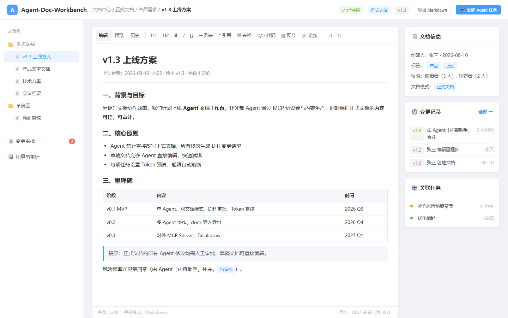
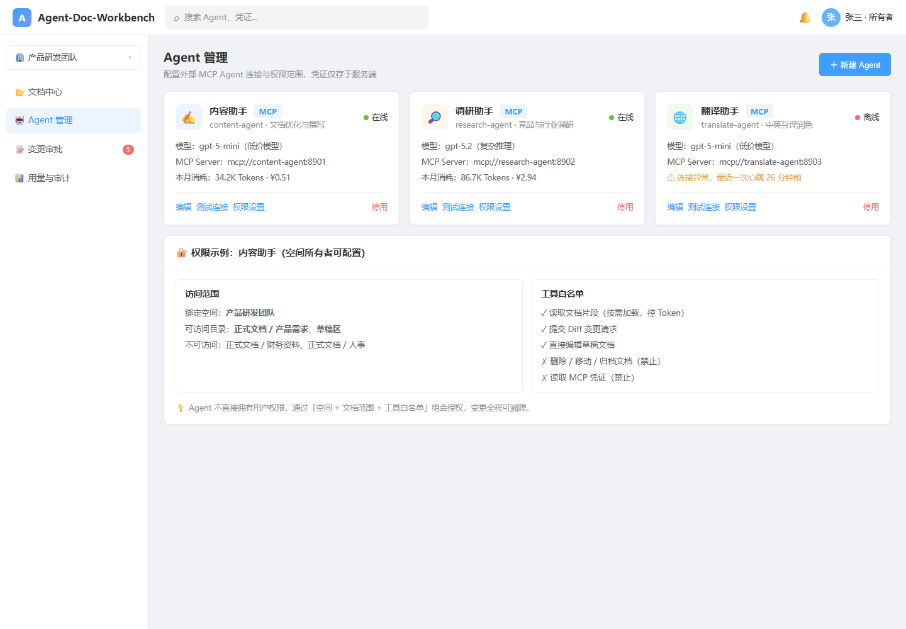
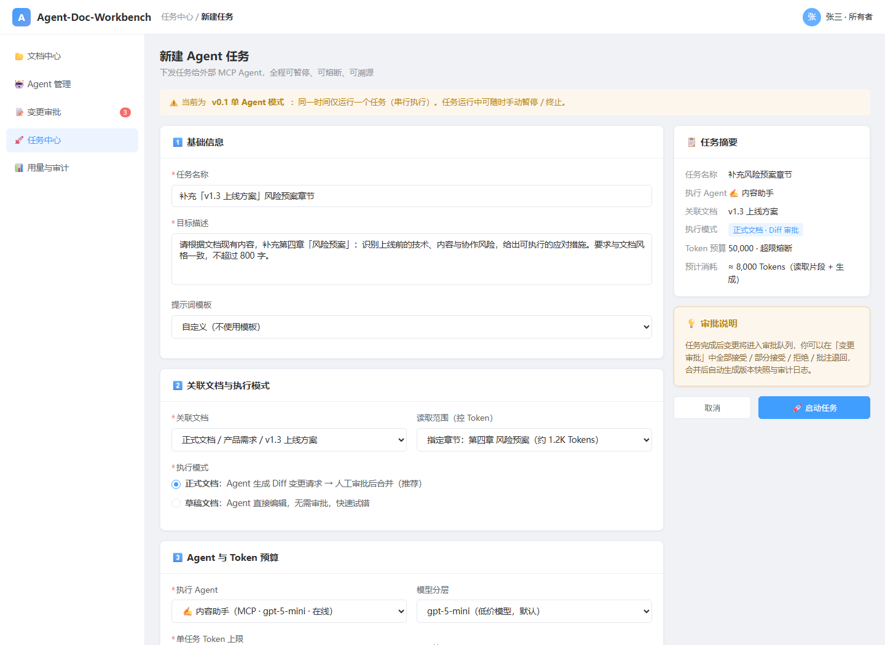
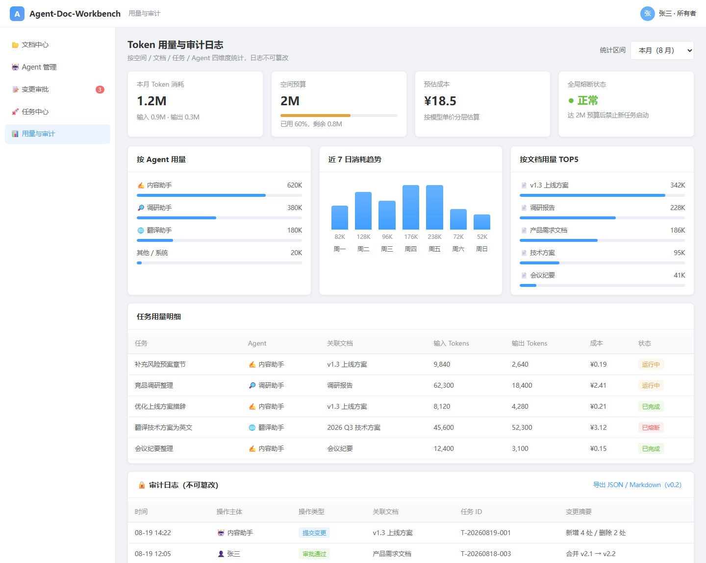
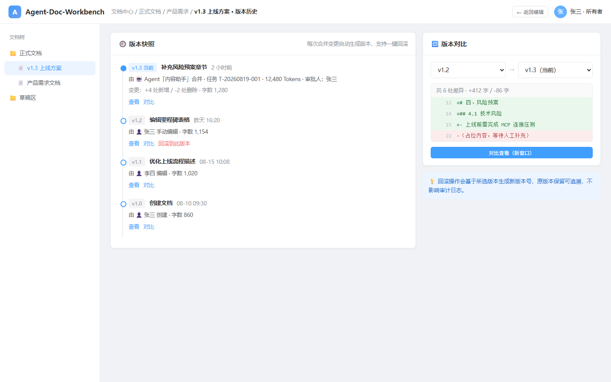

# UI 效果图集

> Agent-Doc-Workbench v0.1 核心页面 UI 效果图（HTML 高保真原型截图）
> 生成日期：2026-08-19 · 风格参考：Element Plus

## 图集一览

| 序号 | 页面 | 说明 | 图片 |
| ---- | ---- | ---- | ---- |
| 01 | 登录页 | 品牌介绍 + 账号/OAuth2 登录 |  |
| 02 | 工作空间首页 | 统计卡片、最近文档、最近任务 |  |
| 03 | 文档编辑页 | ProseMirror 编辑器、文档信息、变更记录 |  |
| 04 | Agent 管理页 | MCP Agent 卡片、权限范围、工具白名单 |  |
| 05 | 任务创建页 | 任务表单、执行模式、Token 预算 |  |
| 06 | Diff 审批页 | 变更队列、差异可视化、审批操作 |  |
| 07 | 用量与审计页 | Token 统计、趋势、任务明细、审计日志 |  |
| 08 | 版本历史页 | 版本时间线、版本对比、回滚入口 |  |

## 覆盖的核心产品概念

- **双文档模式**：正式文档（Diff 审批）/ 草稿文档（直接编辑）
- **Diff 变更审批**：全部接受 / 部分接受 / 拒绝 / 批注退回
- **Token 预算熔断**：任务级预算 + 空间全局预算 + 熔断状态
- **MCP Agent**：外部 Agent 接入、权限范围、工具白名单
- **审计日志**：操作主体（人/Agent）、操作类型、关联任务、全程溯源
- **版本快照**：合并自动生成版本、历史对比、一键回滚

## 待办（非本次范围）

- 仅覆盖 v0.1 的 8 个核心页面；登录后的引导页、错误页、移动端适配等后续补充
- 效果图为概念稿，最终实现以技术方案为准
