# UI 效果图集

> Agent Doc Workbench 当前架构对应的新版高保真概念稿
> 生成日期：2026-08-27
> 目标前端：Vue 3 + TypeScript + Element Plus + ProseMirror

本目录是项目当前使用的正式 UI 效果图集。早期 v0.1 图集已经移除，根目录中英文 README 的预览也已切换到本套图片。

## 为什么更新

旧稿正确表达了“文档作为协作载体、正式文档必须审批、Token 可控、版本可追溯”的产品核心，但当时的 Agent 仍被建模为单个外部 MCP 端点。当前后端已经演进为：

- 一个 Space 可以配置多个 Agent，V0.1 的每个任务由用户明确选择一个 Agent。
- Agent 是执行能力集合，包含主模型、系统提示词、Skill 选择模式、外部 MCP 开关、工具白名单和执行限制。
- Skill 是空间级、ZIP 上传、不可变版本化的能力包；模型先看到轻量目录，再按需加载正文。
- MCP Server 是空间级共享资源，一个 Agent 可以绑定多个外部 MCP，并为每个绑定设置工具白名单。
- 任务执行会冻结 Prompt、Agent 配置、Skill、工具和 MCP 快照，并保留脱敏工具调用审计。
- 正式文档仍禁止 Agent 直接覆盖，执行结果必须形成变更请求并由人工审批。
- 组织与权限规划保留当前空间角色模型，并增加用户、部门、角色与权限标识符管理页面。

## 图集一览

| 序号 | 页面 | 本版重点 | 图片 |
| --- | --- | --- | --- |
| 00 | 登录页 | 产品定位、账号登录与 OAuth2 入口 | 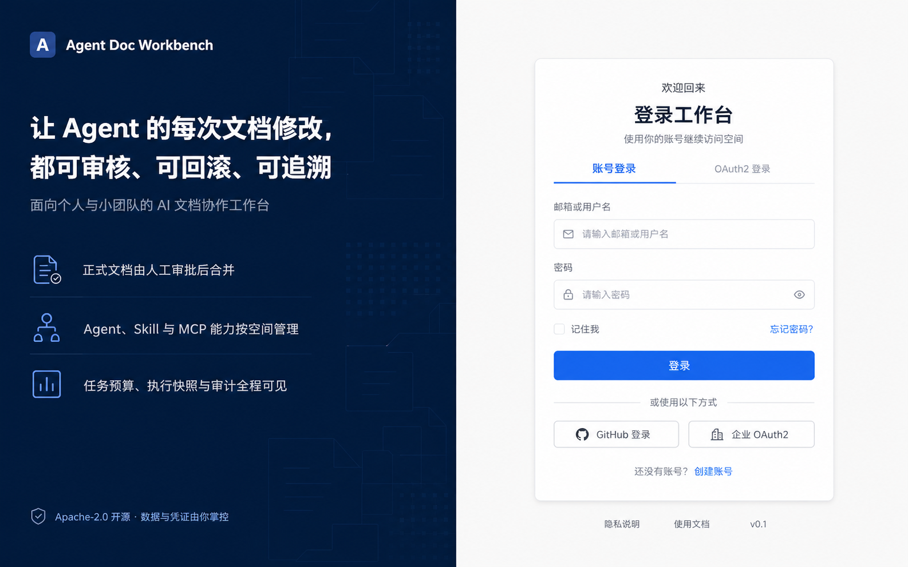 |
| 01 | 空间总览 | 文档、任务、审批与 Agent 能力统一总览 | 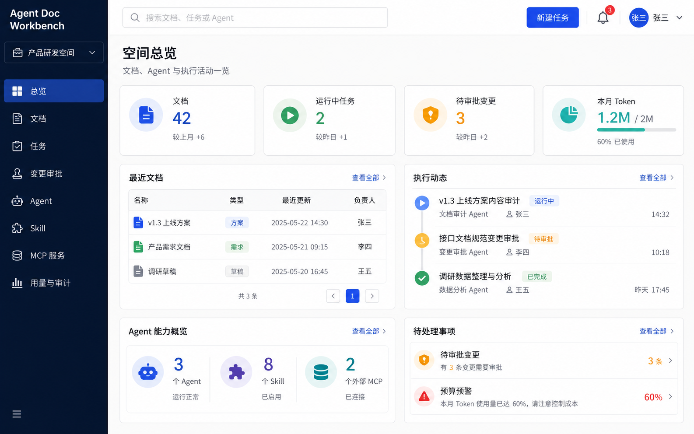 |
| 02 | 文档编辑器 | 正式文档约束、关联任务与变更活动 | 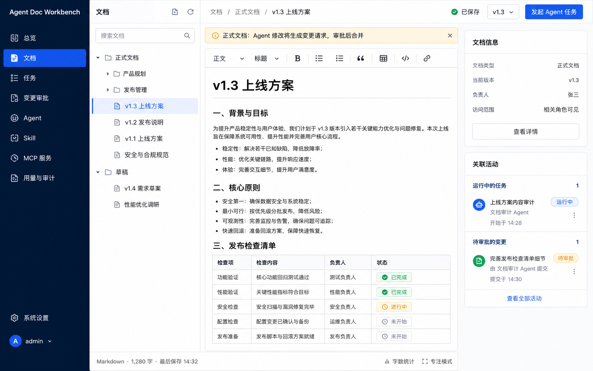 |
| 03 | Agent 管理（卡片版） | 模型、Skill 策略、MCP 和执行边界 | 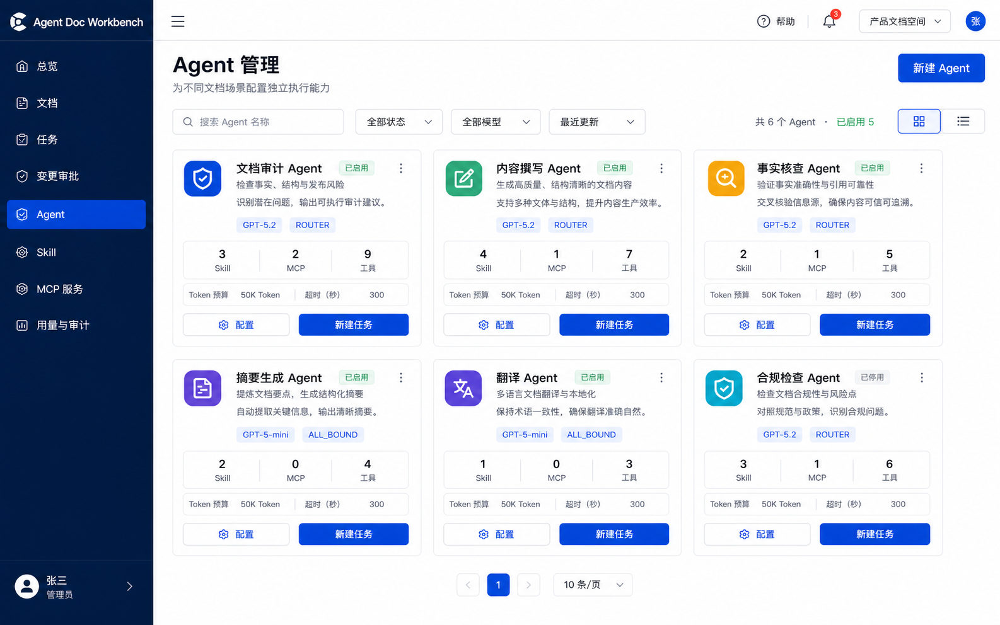 |
| 04 | Skill 管理（卡片版） | 展示名/技术名分离、ZIP 版本与 Agent 绑定 | 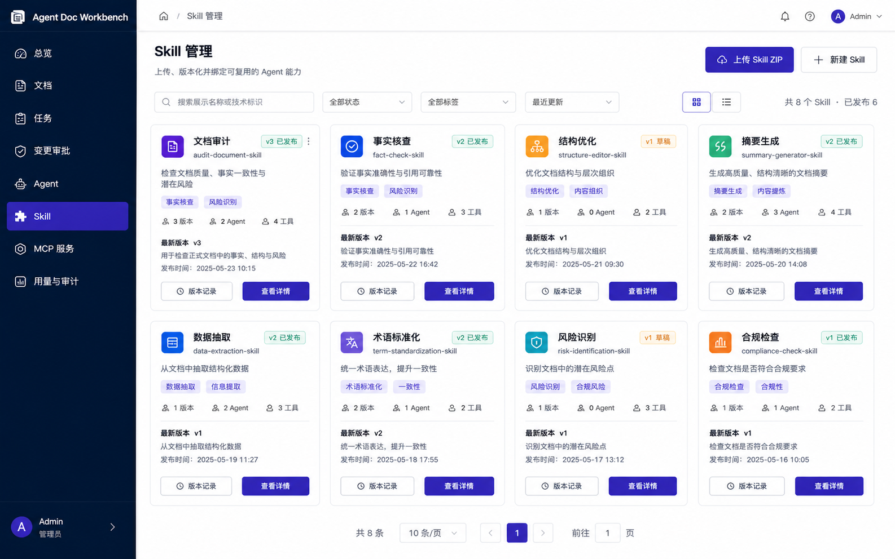 |
| 05 | MCP 服务（卡片版） | 空间级服务、认证状态、Agent 绑定和工具命名空间 | 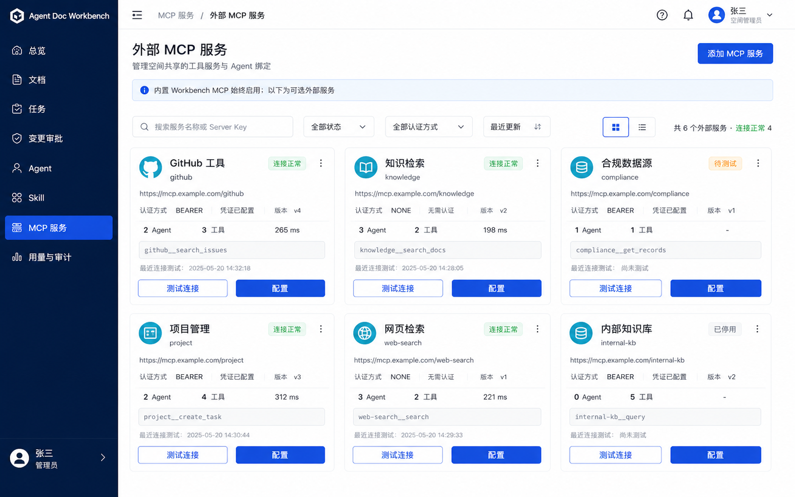 |
| 06 | 新建任务 | V0.1 明确选择单 Agent，能力由 Agent 配置决定 | 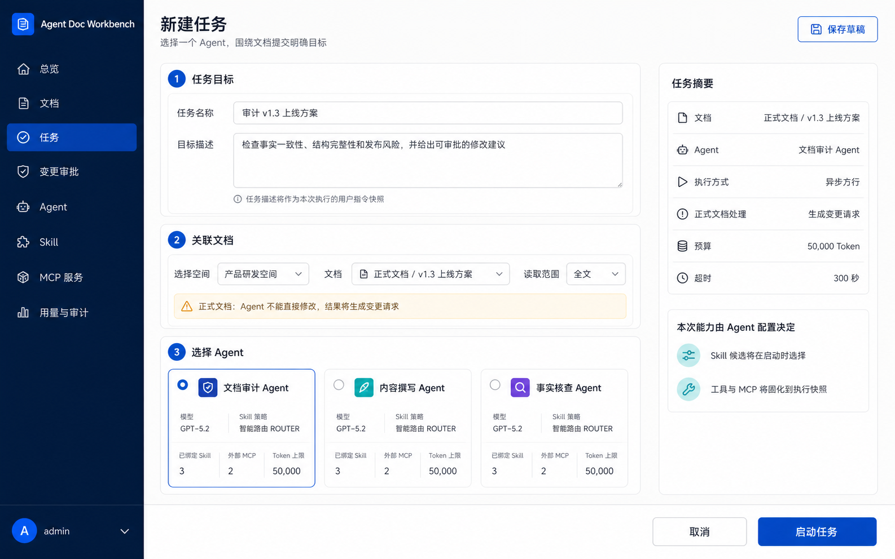 |
| 07 | 任务执行详情 | Skill 路由、工具调用、执行进度与不可变快照 | 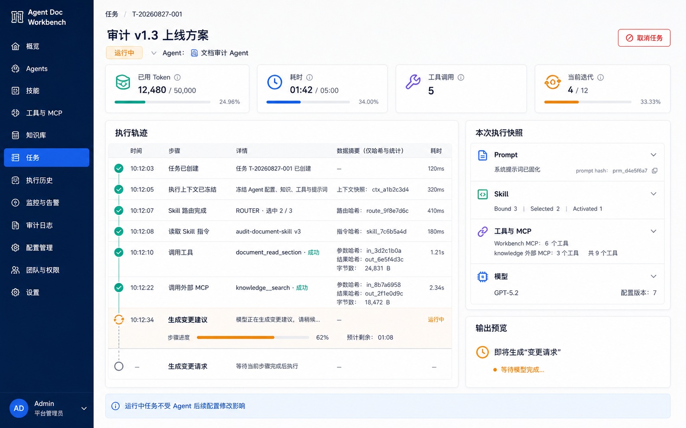 |
| 08 | 变更审批 | 结构化 Diff、部分接受、批注退回和执行溯源 | 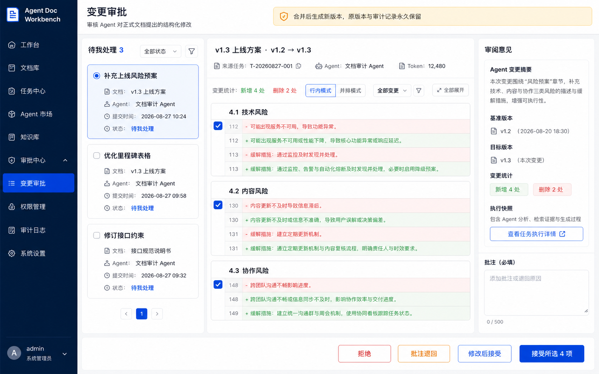 |
| 09 | 用量与审计 | Token、成本、Skill/MCP 来源和脱敏审计 | 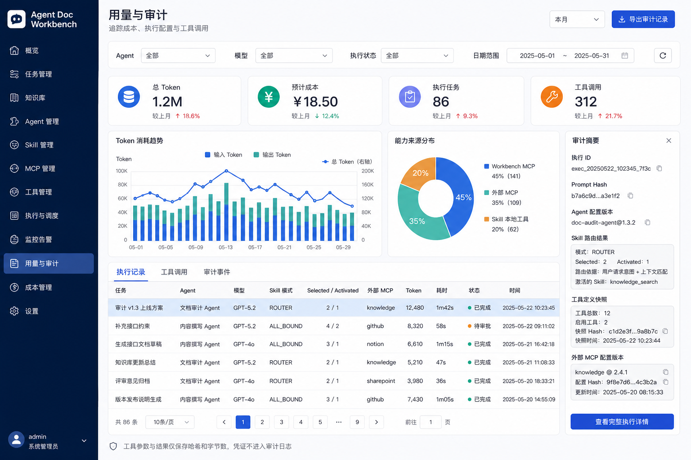 |
| 10 | 版本历史 | 人工/Agent 来源、审批链、版本对比与非破坏性回滚 | 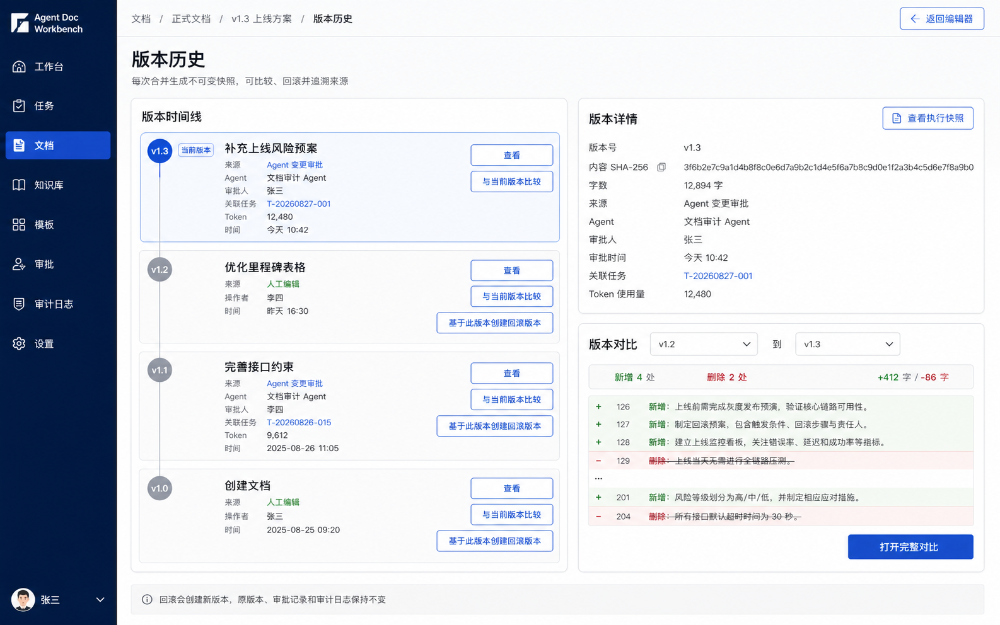 |
| 11 | 能力卡片探索稿 | Agent、Skill、MCP 三类卡片的信息层级对比 | 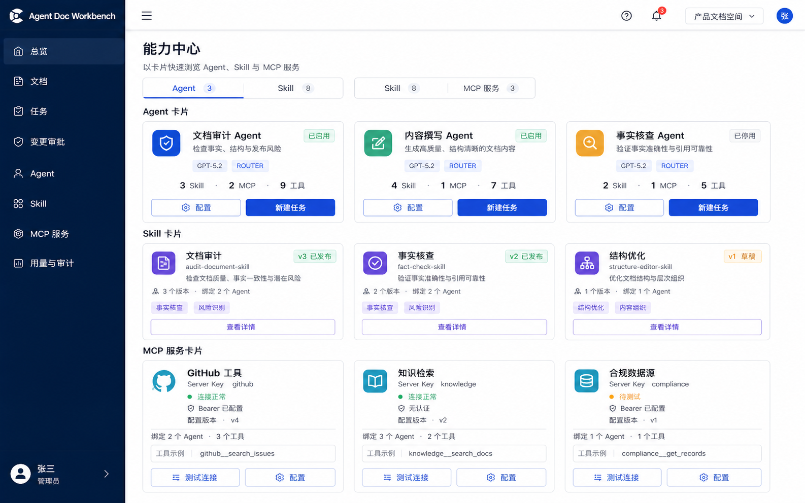 |
| 12 | 用户管理 | 创建账号、部门归属、空间与角色绑定 | 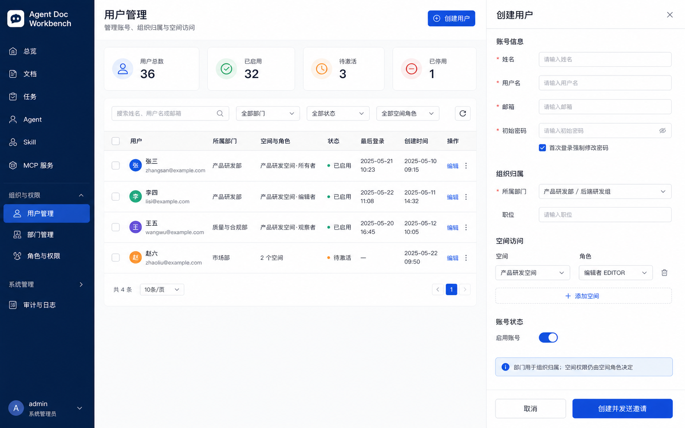 |
| 13 | 部门管理 | 组织树、负责人、成员与关联空间 | 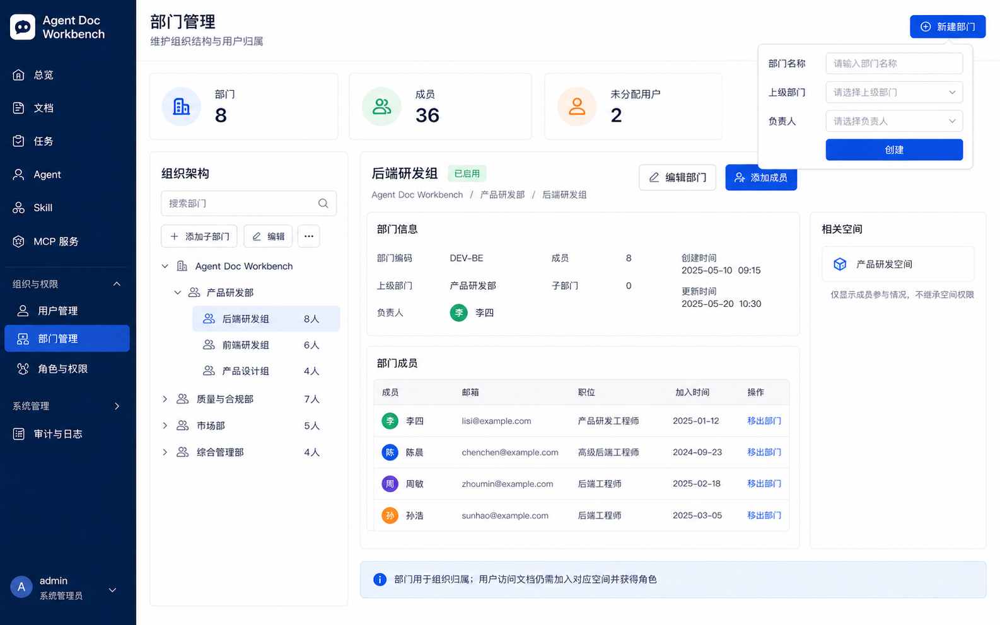 |
| 14 | 角色与权限 | 空间角色、权限标识符、成员绑定与变更记录 | 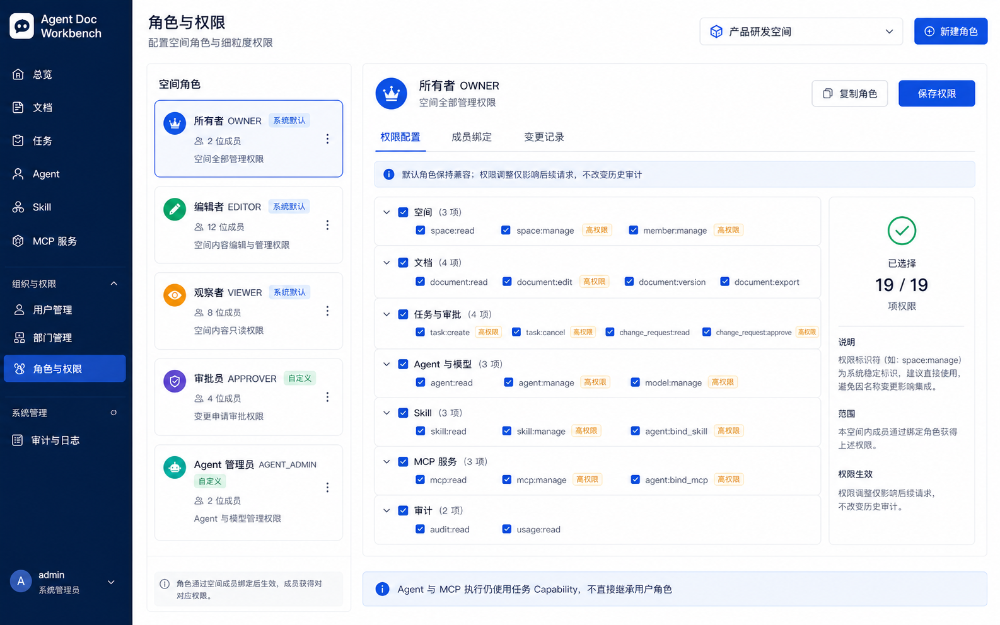 |

第 11 张是布局探索稿，用于评估卡片化方向，不表示必须把三个资源合并到同一个“能力中心”页面。实际实现仍可保留三个一级入口，只复用对应的卡片结构。

`03-agent-management.png`、`04-skill-management.png`、`05-mcp-management.png` 是此前生成的表格/主从布局版本，继续保留用于和卡片版比较，不作为本版主入口。

## 信息架构建议

登录后的一级导航建议稳定为：

```text
总览
文档
任务
变更审批
Agent
Skill
MCP 服务
用量与审计
```

管理员额外看到“组织与权限”分组：

```text
用户管理
部门管理
角色与权限
```

模型配置、系统审计等低频平台能力可放入“系统管理”。普通空间成员不显示组织管理入口，避免继续扩张日常工作导航。

## 关键交互约束

### Agent

- Agent 列表采用卡片网格，突出状态、模型、Skill/MCP 数量和“新建任务”；复杂配置点击卡片进入详情页或抽屉。
- Skill 选择模式是 Agent 配置，使用 `ALL_BOUND` / `ROUTER` 两张解释性单选卡。
- Skill 和 MCP 的具体绑定分别放入 Agent 详情页签，也允许从对应资源管理页反向查看绑定关系。
- Agent 配置变更只影响后续执行，页面必须明确提示运行中任务继续使用原快照。

### Skill

- Skill 目录采用卡片网格，卡片只展示稳定摘要；版本记录、资源清单和绑定关系进入详情。
- 主标题使用中文 `displayName`，技术标识 `name` 作为副标题显示。
- 管理描述使用 `skill.description`；版本详情单独展示来自 `SKILL.md` 的 `activationDescription`。
- SkillVersion 不直接返回或铺开展示完整指令正文，资源与工具清单按需查看。
- 上传手工编辑内容与上传已有包最终都组装为 ZIP，走同一个版本上传接口。

### MCP

- 外部 MCP 列表采用卡片网格，优先展示连接、认证、配置版本、绑定数和工具命名空间；编辑密钥与白名单进入详情。
- 内置 Workbench MCP 与外部 MCP 明确区分；内置能力不是一条可删除的空间配置。
- Server Key 创建后不可修改，并展示最终工具命名示例 `{serverKey}__{toolName}`。
- Token 仅显示“已配置/未配置”，任何读取接口和快照都不回显原文。
- Agent 绑定和每个绑定的工具白名单需要在同一处可见。

### 任务与审计

- V0.1 新建任务只允许选择一个 Agent，不提前设计多 Agent 拖拽编排器。
- 执行详情按时间展示上下文冻结、Skill 选择、指令读取和工具调用，方便定位成本与失败点。
- 普通用户看到可理解的执行摘要；哈希、配置版本等技术信息可以折叠展示。
- 工具参数与结果只展示哈希、字节数、耗时和状态，不展示敏感正文与凭证。

### 正式文档

- Agent 对正式文档的输出只能形成变更请求。
- 审批页始终以人工决策为主视觉，支持全部或部分接受、拒绝、修改后接受和批注退回。
- 合并和回滚都创建新版本，不覆盖旧快照；任务、审批和执行快照之间应互相跳转。

### 组织与权限

- 用户账号是平台身份；用户加入某个 Space 后，通过该 Space 的角色获得权限。
- 部门用于组织树、负责人和用户归属，不自动授予任何文档或空间权限。
- 当前 `OWNER / EDITOR / VIEWER` 作为受保护的默认角色，后续映射到稳定权限标识符并允许增加自定义角色。
- 人类用户使用空间 RBAC；Agent/MCP 执行继续使用任务 Capability，两套权限不能互相替代。
- 若未来需要部门批量加入空间，应设计显式同步和差异确认，不能把部门成员关系直接当作实时授权来源。

## 视觉基线

- 目标是可用 Element Plus 实现的产品界面，不采用概念艺术式布局。
- 深海军蓝侧栏、暖灰页面背景、白色内容卡片，主色使用靛蓝；成功、警告和危险色只表达状态。
- 以 1440px 桌面端为主要设计宽度，信息密集页面优先使用主从布局、抽屉和可折叠详情。
- 避免大面积渐变、拟物插画和过强阴影；强调边框、留白、字号层级与表格可读性。
- 图片是信息架构和视觉方向稿。Phase 6 实现时应以真实字段、权限和接口状态为准，并统一修正文案与组件尺寸。

## 本版暂不展开

- 多 Agent 自主编排、Supervisor 和工作流画布。
- 长期记忆管理界面。
- 移动端和实时多人协同编辑。
- Skill 市场、向量检索和用户脚本执行。
- 部门到空间成员的自动同步、跨组织层级继承和企业目录服务集成。
