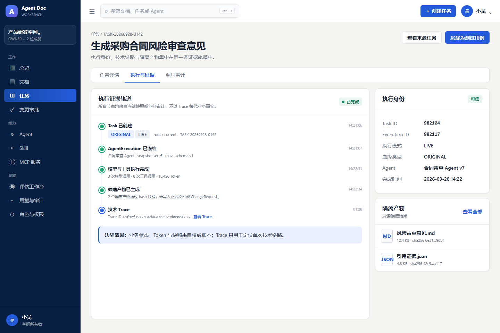
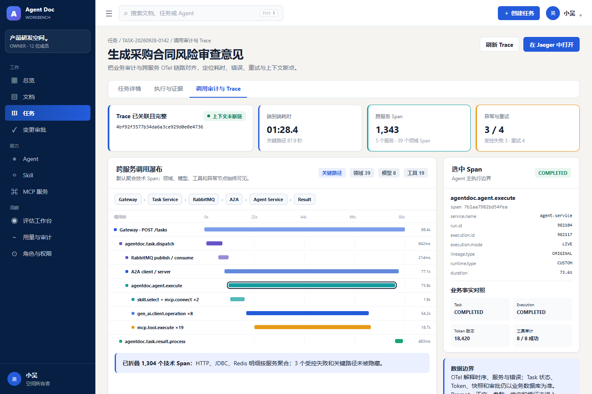
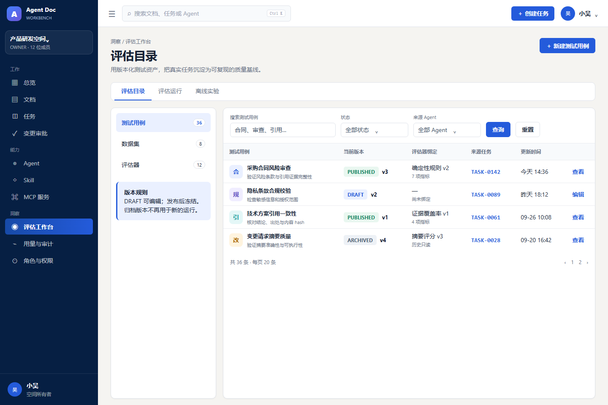
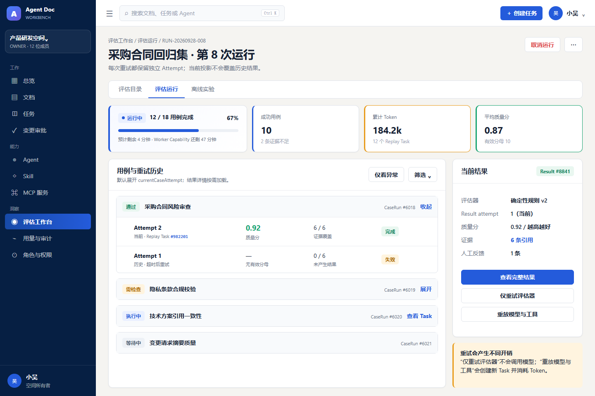
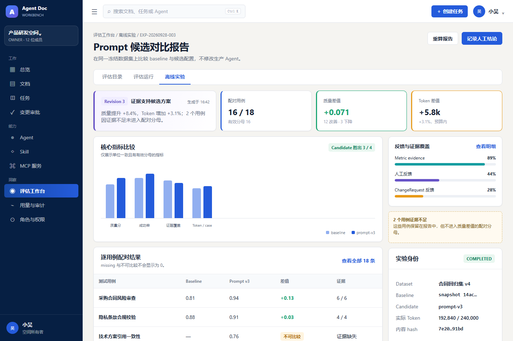

# v0.2.0 UI 效果图

> Phase 5 Engineering UX 设计基线
> 生成日期：2026-09-28

本目录保存 v0.2.0 Phase 5 的目标页面效果图。它们延续现有 Agent Doc Workbench 的深海军蓝侧栏、暖灰背景、白色内容面板、靛蓝主操作和 Element Plus 组件风格，用于约束后续页面实现，不表示对应功能已经发布。

## 图集

| 序号 | 页面 | 设计重点 | 图片 |
| --- | --- | --- | --- |
| 01 | 任务执行与证据 | Run 身份、血缘、冻结快照、Trace 和隔离产物 |  |
| 02 | 调用审计与 Trace | 业务审计与 OTel 联合诊断、跨服务瀑布、关键路径和 Span 白名单属性 |  |
| 03 | 评估目录 | Evaluator、TestCase、Dataset 的版本化管理入口 |  |
| 04 | EvaluationRun | CaseAttempt、EvaluationResult、证据和两级重试 |  |
| 05 | 离线实验报告 | baseline/candidate 对比、有效分母、缺失值、证据覆盖和人工结论 |  |

## 使用边界

- 页面字段、权限和状态以[Engineering Workbench 页面与查询契约](../../workbench-engineering-ux-contract.md)、[ADR](../../adr/README.md)和最终接口为准。
- OTel 页面展示按 Task 授权的只读白名单投影，不代表向浏览器开放原始 Jaeger JSON。
- Trace 负责技术时序与错误定位；Task 状态、Token、快照、审批和评估结果仍以业务数据库为准。
- Phase 5 不包含受控线上 A/B，也不进行版本发布；对应工作分别留给 Phase 6 和 Phase 7。
- 图片用于布局和视觉参考，示例身份、状态、数值和按钮可见性不构成接口或安全契约。

## 实现时必须对齐的示例差异

- 图 01 展示候选隔离产物时，应使用真实 `ISOLATED` 执行及其血缘，不照搬示例中的 `ORIGINAL + LIVE`；LIVE 页面不能把正常文档草稿标成隔离产物。执行快照 schema 按对应历史记录展示，不能固定使用图中 v1。
- 图 02 的“在 Jaeger 中打开”仅在正式契约规定的访问控制/Space 隔离门禁通过且显式启用时出现，默认隐藏；瀑布名称必须经过白名单映射。
- 图 04 的 Worker Capability 剩余时间仅为原型说明，首版页面展示运行状态和暂停原因，不向用户暴露内部凭证或将凭证倒计时作为新增接口需求。
- 菜单文案、分页默认值和指标分母按正式页面/查询契约及实际业务数据实现，不照搬图片占位内容。
